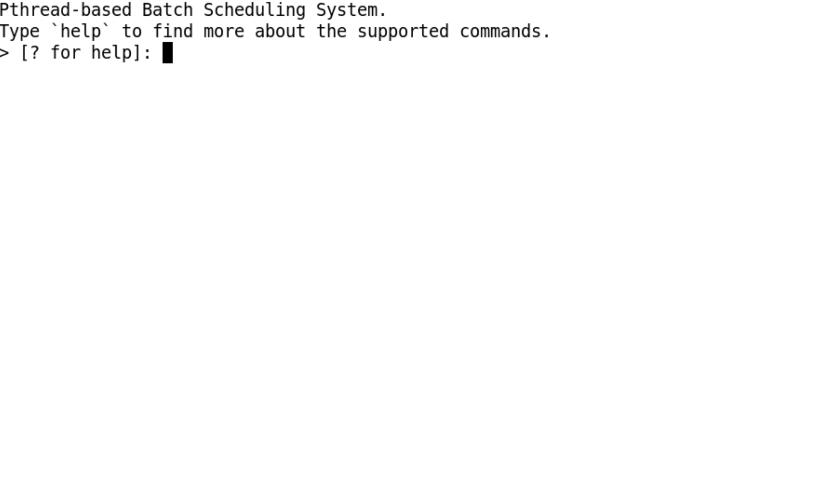

#  Real-time process scheduling with real process execution



## CONTENTS OF THIS FILE

 * [Introduction](#intro)
 * [Main Project Design](#design)
   * [Scheduling Module](#sched_mod)
   * [Dispatcher Module](#dispatch_mod)
   * [Testing Module](#test_mod)
 * [Usage](#usage)

## INTRODUCTION<a name="intro"></a>
The goal of this project was to create a real batch scheduling system using Pthreads. The scheduling system adds **real jobs** from either the **user** or a **testing module** and executes them (executes a benchmark program for the length of the given jobs CPU burst time). The system consists mainly of two modules, the scheduler and dispatcher. The **scheduler module** is in charge of  adding and scheduling new jobs into the job queue. The **dispatching module** oversees taking ready jobs out of the queue and executing them. Many of the modules or threads are using shared resources, the project supports multiple commands which will be highlighted in the coming sections. Note that some parts of the project are updated in real-time, and some simple animations have been created to illustrate some commands, like how the test command runs and how jobs are transmitted from the ready to the running and on to the completed stage.

## Main Project Design<a name="design"></a>  
 The design of this project was made to be modular, meaning that each functionality or task was put in a separate module that only does that certain task. The main two modules (or threads) are the schedular and dispatcher threads, which are actively running and interacting with the jobs and queue. An explanation of these two threads is detailed below, as well as other modules.
### Scheduling Module<a name="sched_mod"></a>    
The schedular is in charge of how jobs are added to the queue and when to change their order depending on the scheduling policy. The schedular has two main functions, that are listed below:
1. **Adding new jobs to the queue:** For this task, the schedular uses a variable (job) called new_job to see if it has been updated and it adds it to the queue (the new job variable is set in the run command, which is invoked by the user). In addition to adding the new job to the queue, the schedular also makes sure that the newly added job follows the currently set scheduling policy.

2. **Updating the scheduling policy:** For this task, when the schedular notices that there has been a change in the scheduling policy it will take care of updating the queue that has the job depending on the newly selected policy (SJF means shorter-burst CPU jobs will be at the start of the queue).

The code below shows how synchronization is handled between the different threads and the use of conditonal variables.
```C
/*
* To make sure that the scheduler has execlusive access
* to the queue and sleep in case the queue buffer is fill.
*/
pthread_mutex_lock(&job_queue_lock);
while (queue_full()) {
  pthread_cond_wait(&job_buf_not_full, &job_queue_lock);
}

/*
* To make sure that the scheduler is not in an infinite loop,
* especially when there are no jobs in the queue nor has the
* user added a new job, the scheduler will go into idle/sleep
* mode while the queue is empty and the user has not added any
* new jobs. This keeps CPU usage at a minimum.
*/
pthread_mutex_lock(&new_job_job_lock);
while (queue_empty() && new_job.id == -1) {
  pthread_cond_wait(&job_buf_not_idle, &new_job_job_lock);
}
```


### Dispatcher Module<a name="dispatch_mod"></a>  
The dispatch module is in charge of executing the ready jobs (the job waiting at the start of the queue). This is done in the following order:
1. First the dispatcher **retrieves the job** at the beginning of the queue and set’s it’s start time.
2. The dispatcher then uses the fork( ) command to **create a child process that will use the execv( )** command to execute a benchmark.
3. After the child process terminates (the benchmark is done), the parent (the original dispatcher) **records the finish time for this job**, updates it’s other times like the wait and turnaround time, and finally it adds this job to an array that houses completed jobs.


### Testing Module <a name="test_mod"></a>
Unlike the previously described modules (**threads**) that are always running and interacting with the job queue, this module is run on demand when the user enters the **`test`** command. This module is responsible for creating a testing environment that is completely configurable by the user using different parameters that set the testing environment. The main format of the test command is shown below. The benchmark is the name of the benchmark to be executed in the test command, it can either be **`batch_job`** which is a program that has an exhaustive loop until a time limit is reached, or **`sleep_job`** which is a job that uses the sleep command to sleep precisely the number of microseconds needed. The policy can be any of the following [**fcfs, sjf, priority**]. Arrival rate is the rate at which the jobs arrive. The other parameters are self-explanatory.

The code below shows usage of the test module using the test command.

```sh
$ > [? for menu]: test batch_job fcfs 15 5 10 1 4
```

## Usage<a name="usage"></a>
> **Compilation**
```sh
$ make
```

> **Running the program**
```sh
$ ./main
```

> **Running different commands**
```sh
# Run a job with name <j> and CPU time <time> and priority <priority>.
$ > [? for menu]: run <j> <time> <priority>
# List all completed, running, and pending jobs.
$ > [? for menu]: list
```

> **Testing scheduling policies and workloads**
```sh
# Test the program with the given parameters. Where <b> is benchmark name, <p> is policy, 
# <n> is number of jobs, <a> is arrival rate, is priority levels, <min> <max> are min/max CPU time.
$ > [? for menu]: test <b> <p> <n> <a> <l> <min> <max>
```
